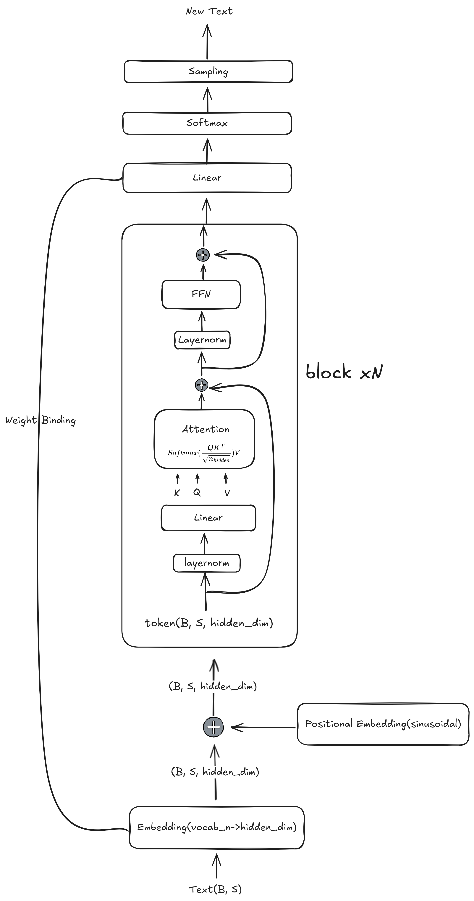

# NanoGPT

本项目参照 [NanoGPT](https://github.com/karpathy/nanoGPT) ，实现了一个简单易用的 GPT 语言模型。适合用于学习和实验生成式预训练变换器（GPT）的核心原理。

## 📂 项目结构

本项目采用模块化设计，便于扩展和实验。

### 顶级目录
*   `train.py`：模型训练的主入口脚本。
*   `eval.py`：模型评估与文本生成脚本。
*   `setup.py`：安装脚本（依赖清单）。
*   `README.md`：项目说明文档与路线图。

### 源码模块 (`src/`)
核心逻辑位于 `src/` 目录下。
*   `src/model.py`：定义 Transformer 架构（Attention, FFN, LayerNorm）。
*   `src/dataloader.py`：负责数据加载与预处理。
*   `src/tokenizer.py`：处理文本的分词逻辑。
*   `src/config.py`：**配置文件**。集中管理所有超参数和路径设置。

### 测试 (`tests/`)
包含单元测试以确保组件可靠性。
*   `tests/test_attention.py`：验证 Attention 机制的输出形状。

## 🚀 快速开始

### 环境准备

Python >= 3.12。请根据您的环境安装 `torch` 等深度学习依赖。

### 训练模型

首先准备您的数据，然后运行训练脚本：

```bash
python train.py
```

模型将基于配置文件中的数据路径进行训练。详细参数请参阅 `src/config.py`。

### 模型评估与文本生成

训练完成后，使用评估脚本进行推理或生成文本：

```bash
python eval.py
```

您可以根据需要修改脚本参数，以生成不同的文本。

## 📖 代码说明

- **`train.py`**：整合了数据加载、模型初始化和训练循环。
- **`src/model.py`**：实现了 GPT 模型的核心组件，包括多头注意力机制和前馈网络。
- **`src/tokenizer.py`**：简单的字符级分词器实现。
- **`src/config.py`**：管理如 `batch_size`、`learning_rate` 等超参数。

## 流程图


## 🗺️ Roadmap & Learning Path

### Phase 1
- [x] **代码重构与注释**：对 `gpt.py` 进行逐行注释，绘制数据流图；添加 Type Hinting 增强代码可读性。
- [x] **单元测试 (Unit Tests)**：为 Attention、FeedForward 等模块编写测试用例，确保形状（Shape）变换正确。
- [x] **可视化监控**：接入 WandB 或 TensorBoard，监控 Loss、Grad Norm、Learning Rate 变化，学会通过曲线诊断训练问题。
- [ ] **HuggingFace 兼容**：编写脚本支持加载/导出 HuggingFace 格式权重，方便利用社区生态进行评估。

### Phase 2
- [x] **位置编码升级**：移除绝对位置编码，实现 **RoPE (Rotary Positional Embeddings)**。
- [x] **归一化升级**：将 LayerNorm 替换为 **RMSNorm**，并尝试 Pre-Norm 架构。
- [ ] **激活函数升级**：将 GELU 替换为 **SwiGLU**。
- [ ] **注意力机制优化**：实现 **GQA (Grouped Query Attention)**，理解 KV Cache 的显存优化原理。
- [ ] **权重初始化**：研究并复现不同的初始化策略（如 MuP），观察对收敛速度的影响。

### Phase 3
- [ ] **算子融合**：集成 **Flash Attention 2**，对比手动实现 Attention 的速度差异。
- [ ] **混合精度训练**：完善 `bfloat16` 训练流程，理解精度溢出与数值稳定性问题。
- [ ] **分布式训练基础**：从 DDP (DistributedDataParallel) 进阶到初步理解 FSDP (Fully Sharded Data Parallel)。
- [ ] **自定义算子 (Optional)**：尝试用 Triton 或 CUDA 编写一个简单的 LayerNorm 或 Softmax 算子，理解 Kernel 优化。

### Phase 4
- [ ] **长窗口扩展**：尝试实现 ALiBi 或 YaRN 等长上下文技术。
- [ ] **稀疏化模型**：实现简单的 **MoE (Mixture of Experts)** 架构。
- [ ] **推测解码 (Speculative Decoding)**：利用小模型辅助大模型加速推理，编写完整的 draft-verify 循环。
- [ ] **参数高效微调 (PEFT)**：手动实现 LoRA (Low-Rank Adaptation)，而不是直接调库，理解其梯度更新逻辑。

### Phase 5
- [ ] **Tokenizer 深入**：训练自己的 BPE Tokenizer，对比不同词表大小对压缩率的影响。
- [ ] **指令微调 (SFT)**：构建简单的指令数据集，实现 Chat 模式。
- [ ] **偏好对齐**：尝试实现 DPO (Direct Preference Optimization)，理解 RLHF 的简化版本。

## 许可协议

本项目采用 MIT License。
